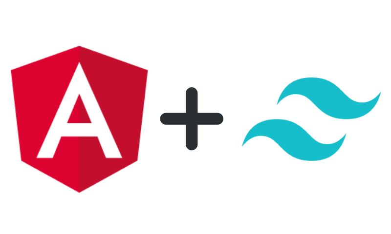

# **ngTailwind - Angular with TailwindCSS**



<br />

### **Firstly, a huge thanks to Jacob Neterer for the original medium article on this**

Please check out his tutorial on [Medium](https://medium.com/@jacobneterer/angular-and-tailwindcss-2388fb6e0bab)

<br />

## **Create Your Angular App**

First, let’s create our angular application

<br />

> `ng new tailwindcss-angular-app`

<br />

When the CLI asks you which styling framework to use, choose SCSS

<br />

## **Set Up TailwindCSS**

<br />

### **Install dependencies**

**Next, let's install [TailwindCSS](https://www.npmjs.com/package/tailwindcss)**


<br />

> `npm install tailwindcss -D`

<br />

Next, we will install [@angular-builders/custom-webpack](https://www.npmjs.com/package/@angular-builders/custom-webpack) for a custom webpack build step and the various postcss packages for building Tailwind.

<br />

> `npm install @angular-builders/custom-webpack postcss-scss postcss-import postcss-loader -D`

<br />

### **Create** `webpack.config.js`

Create a `webpack.config.js` file at the root of your project with the following contents:

<br />

```
module.exports = {
  module: {
    rules: [
      {
        test: /\.scss$/i,
        loader: "postcss-loader",
        options: {
          postcssOptions: {
            ident: "postcss",
            syntax: "postcss-scss",
            plugins: ["postcss-import", "tailwindcss", "autoprefixer"],
          },
        },
      },
    ],
  },
};
```

<br />


### **Modify angular.json**

This will tell our application to use our custom builder for Angular’s CLI build and serve commands.

<br />

```
ng config projects.<your-project>.architect.build.builder @angular-builders/custom-webpack:browser

ng config projects.<your-project>.architect.build.options.customWebpackConfig.path webpack.config.js

ng config projects.<your-project>.architect.serve.builder @angular-builders/custom-webpack:dev-server

ng config projects.<your-project>.architect.serve.options.customWebpackConfig.path webpack.config.js
```

<br />

### **Initialize TailwindCSS**

To create the configuration file for TailwindCSS, execute the following:

<br />

> `npx tailwind init`
<br />

TailwindCSS ships with default styles, but you can use this file to customize themes, breakpoints, colors, spacing, and more!

<br />

### **Inject Tailwind’s Styles**

In your root style sheet `src/styles.scss` inject Tailwind’s `base`, `component`, and `utilities` styles:

<br />

```
@import 'tailwindcss/base';
@import 'tailwindcss/components';
@import 'tailwindcss/utilities';
```

<br />

### **Test it Out!**

Paste the following code into your `app.component.html` file, run your app `ng serve`, and see TailwindCSS working in your own Angular application!

<br />

```
<div class="flex items-center justify-center flex-col h-screen">
  <h1 class="my-8 text-center text-6xl font-bold text-gray-700">
    <span class="text-teal-500">TailwindCSS
    </span > and <span class="text-red-600">Angular</span > is awesome!
  </h1>
  <p class="text-center text-3xl text-gray-700">Thanks for reading!</p>
</div>
```

<br />


<br />

## **Bonus: Purge Unused TailwindCSS Classes**

At this point, when building our application for production `ng build --prod`, you will see a whopping ~1.8MB `styles.css` file.

<br />

In general, you are only going to use a fraction of the classes that TailwindCSS provides, so we can safely purge any unused classes.

<br />

## First, install `dotenv.`

<br />

> `npm install dotenv -D`

<br />

We will use `dotenv` for loading an environment variable that tells Tailwind if we need to purge unused classes or not.

<br />

Next, let’s modify our `tailwind.config.js` file to purge any unused classes. We simply require `dotenv`, access the `ENABLE_PURGE` environment variable (if not found, say in your local environment, defaults to false), set purge enabled to true if purge is true, and search any `*.html` and `*.scss` files for classes that we’ve used.

<br />

```
+require('dotenv').config();
+const enablePurge = process.env.ENABLE_PURGE || false;
module.exports = {
-  purge: [],
+  purge: {
+    enabled: enablePurge,
+    content: [
+      './src/**/*.html',
+      './src/**/*.scss'
+    ]
+  },
  theme: {
    extend: {},
  },
  variants: {},
  plugins: [],
}
```

<br />

Lastly, don’t forget to create your `.env` file with `ENABLE_PURGE` set to true. As a note, you don’t need to do this for local development, but I do urge purging any unused classes in higher environments like test and production.

<br />

> ENABLE_PURGE=true

<br />

Now if you run `ng build --prod` your styles.css file will look much, much smaller, a solid 5.24KB.